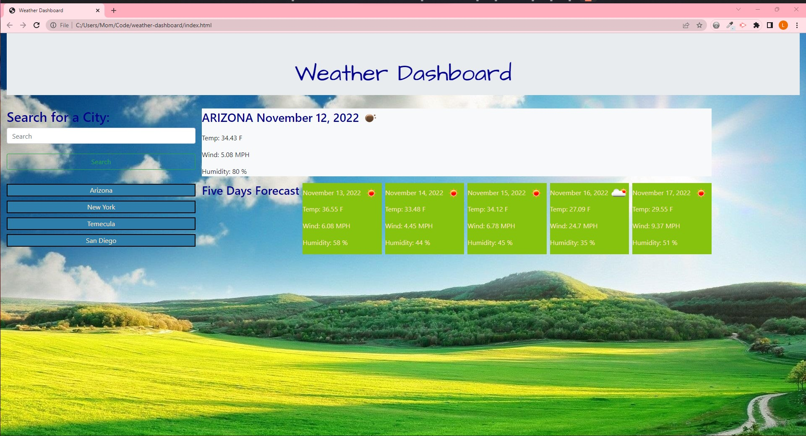
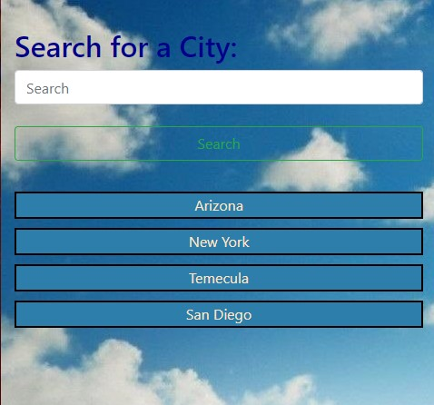
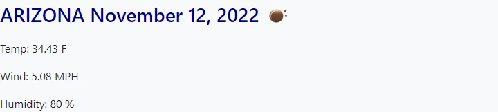
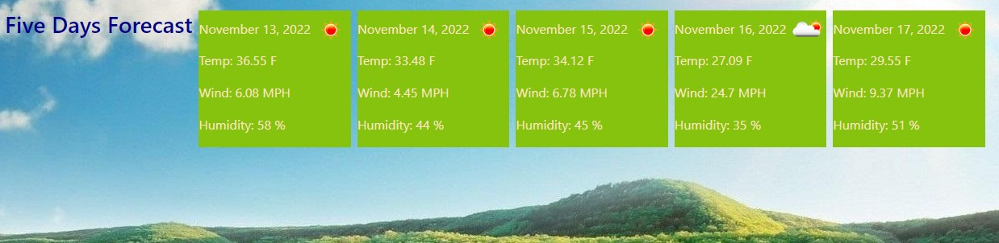

# weather-dashboard

## Description

For the Server-Side APIs Challenge , I've made a Weather DashBoard which can show you the current and the next 5 days forecast weather for multiple cities. By in put your desire city in the search box, you can see the weather pops up after you hit the search button. The dashboard will show you the Date, Temp, Wind, and Humidity of the city that you choose.

## Usage

1. To view the webpage, please follow this URL: https://linhklatt.github.io/weather-dashboard/

2. This is my Weather Dashboard. There are some city samples that show as the screenshots. The recent city is Arizona. All the searched cities will be save in local storage and show on the left side of the webpage.

You can input your city you wish to look up in this search box then you click the search button below the search box

This show the current weather of Arizona at the moment

This shows the next five days forecast of Arizona city.

## License

N/A

## Credit

Please refer to the license in the repo.
